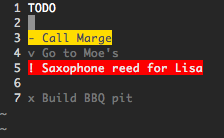

vim-twodo
=========

To-do list plugin for Vim. Provides syntax highlighting and mappings to help
manage my personal to-do lists. To-do files use a `.todo` extension.

## Screenshot

## Syntax
Certain line prefixes define different to-do types. These types will be coloured
differently by the plugin's syntax highlighter.

	- Regular priority to-dos are prefixed with a `- `
	_ A low priority to-do
	! A high priority to-do
	x A deleted to-do
	S A partially completed to-do
	v A completed to-do

## License
Copyright © 2016 Teddy Wing. Licensed under the GNU GPLv3+ (see the included
COPYING file).
